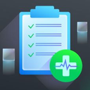

<p align="center">
  
</p>

<h1 align="center">Veeam Health Check</h1>

<p align="center">
  <strong>Generate comprehensive configuration reports for your Veeam environment in minutes.</strong>
</p>

<p align="center">
  <a href="https://github.com/VeeamHub/veeam-healthcheck/actions/workflows/ci-cd.yaml"></a>
  <a href="https://github.com/VeeamHub/veeam-healthcheck/actions/workflows/codeql.yml"></a>
  <a href="https://github.com/VeeamHub/veeam-healthcheck/releases/latest"></a>
  <a href="LICENSE"></a>
  
</p>

<p align="center">
  <a href="https://github.com/VeeamHub/veeam-healthcheck/releases/latest"><strong>Download Latest Release</strong></a> &nbsp;&middot;&nbsp;
  <a href="https://htmlpreview.github.io/?https://github.com/VeeamHub/veeam-healthcheck/blob/master/SAMPLE/Veeam%20Health%20Check%20Report_VBR_anon_2024.11.01.101304.html"><strong>View Sample Report</strong></a> &nbsp;&middot;&nbsp;
  <a href="https://github.com/VeeamHub/veeam-healthcheck/issues/new/choose"><strong>Report an Issue</strong></a>
</p>

---

> [!NOTE]
> This is a community-supported tool from [VeeamHub](https://github.com/VeeamHub) and is not an officially supported Veeam product. It does not phone home or communicate with anything beyond your Veeam infrastructure components.

## What It Does

Veeam Health Check is a lightweight Windows utility that analyzes your **Veeam Backup & Replication (VBR)** or **Veeam Backup for Microsoft 365 (VB365)** installation and produces a detailed, single-page HTML report covering:

- **Job session analytics** — min/max/average for duration, backup size, data size, and wait times
- **Success & change rates** across your environment
- **Concurrency heat maps** — job and task overlap visualized over time
- **Configuration review** — highlighting areas for potential improvement
- **Curated guidance** — best practices, recommendations, and links to relevant documentation

Export as **HTML**, **PDF**, or **PowerPoint**. Use **scrubbed mode** to anonymize sensitive data before sharing.

## Quick Start

1. **[Download](https://github.com/VeeamHub/veeam-healthcheck/releases/latest)** the latest `VeeamHealthCheck.zip`
2. **Extract** the archive on your Veeam server
3. **Run** `VeeamHealthCheck.exe` as Administrator
4. **Configure** options in the GUI (or use CLI flags below)
5. **Accept** the terms and click **RUN**
6. **Review** the generated report

## Supported Platforms

| Product | Supported Versions | Notes |
|---|---|---|
| **Veeam Backup & Replication** | v12.3, v13 (Windows & Linux) | For v11 or v12 (pre-12.3), use [Health Check v2](https://github.com/VeeamHub/veeam-healthcheck/releases/tag/v2.0.0.681) |
| **Veeam Backup for Microsoft 365** | v6, v7, v8 | |

### Requirements

- Run as an **elevated user** with **Backup Administrator** role
- Must execute on a system with VBR Console or VB365 installed
- **500 MB** free disk space on `C:\` (default output: `C:\temp\vHC`)
- Veeam Cloud Service Provider servers are **not** supported

## CLI Reference

```
VeeamHealthCheck.exe [options]
```

| Option | Description |
|---|---|
| `/run` | Execute health check via CLI |
| `/gui` | Launch graphical interface |
| `/help` | Show full help menu |
| `/days:<N>` | Reporting window: 7, 12, 30, or 90 days (default: 7) |
| `/outdir=<path>` | Output directory (default: `C:\temp\vHC`) |
| `/pdf` | Also export as PDF |
| `/pptx` | Also export as PowerPoint |
| `/scrub:true` | Anonymize sensitive data |
| `/lite` | Skip per-job HTML exports (faster) |
| `/show:report` | Open report in browser when done |
| `/show:files` | Open output folder in Explorer |
| `/remote` | Enable remote execution |
| `/host=<hostname>` | Target remote Veeam server |
| `/security` | Run security-focused assessment only |
| `/import[:<path>]` | Generate report from existing CSV data |
| `/clearcreds` | Clear stored credentials |
| `/debug` | Enable debug logging |

### Examples

```powershell
# Standard health check
VeeamHealthCheck.exe /run

# 30-day window with PDF export
VeeamHealthCheck.exe /run /days:30 /pdf

# Custom output directory, open report when done
VeeamHealthCheck.exe /run /outdir=D:\Reports /show:report

# Remote VBR server
VeeamHealthCheck.exe /run /host=vbrserver.veeam.local

# Security-focused assessment on a remote server
VeeamHealthCheck.exe /security /host=vbrserver.veeam.local

# Generate report from previously collected data
VeeamHealthCheck.exe /import:D:\Exports\VBR-data
```

## Troubleshooting

| Problem | Solution |
|---|---|
| **"Access Denied"** | Run as Administrator with Backup Administrator role |
| **"No Veeam installation detected"** | Tool must run on a system with VBR Console or VB365 installed |
| **Low disk space errors** | Ensure `C:\` has at least 500 MB free |
| **PowerShell errors** | Verify PowerShell 7+ is installed |

## Building from Source

**Requirements:** .NET 8.0 SDK, Windows, PowerShell 7+

```bash
dotnet restore vHC/HC.sln
dotnet build vHC/HC.sln --configuration Release
```

**Run tests** (Windows only):
```bash
dotnet test vHC/VhcXTests/VhcXTests.csproj
```

## Contributing

We welcome contributions! Create [issues](https://github.com/VeeamHub/veeam-healthcheck/issues/) for bugs and feature requests, or submit a pull request. See our [Contributing Guide](CONTRIBUTING.md) for details.

## License

[MIT](LICENSE)
