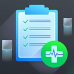
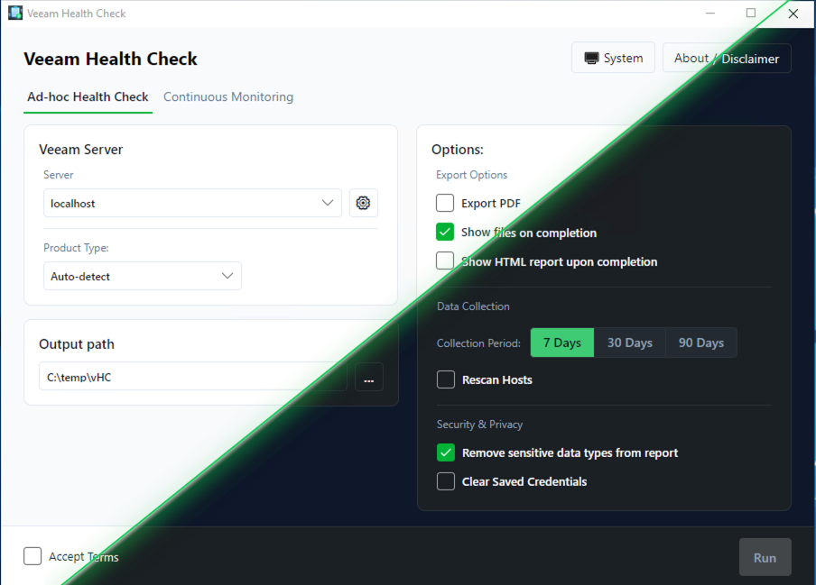

# Veeam Health Check

**Generate comprehensive configuration reports for your Veeam environment in minutes.**

  

---

!!! note "Community Tool"
    This is a community-supported tool from [VeeamHub](https://github.com/VeeamHub) and is not an officially supported Veeam product. It does not phone home or communicate with anything beyond your Veeam infrastructure components.

  

## What It Does

Veeam Health Check is a lightweight Windows utility that analyzes your **Veeam Backup & Replication (VBR)** or **Veeam Backup for Microsoft 365 (VB365)** installation and produces a detailed, single-page HTML report covering:

| Area | Details |
|------|---------|
| **Job Session Analytics** | Min/max/average for duration, backup size, data size, and wait times |
| **Success & Change Rates** | Environment-wide visibility across all jobs |
| **Concurrency Heat Maps** | Job and task overlap visualized over time |
| **Configuration Review** | Highlights areas for potential improvement |
| **Curated Guidance** | Best practices, recommendations, and links to relevant documentation |

## Export Formats

- **HTML** — single-file report with embedded CSS and JavaScript
- **PDF** — via DinkToPdf
- **PowerPoint** — via HtmlToOpenXml
- **Scrubbed Mode** — anonymizes IPs, server names, and credentials before sharing

## Quick Links

- [Getting Started](getting-started.md) — download, install, and run
- [Features](features.md) — full feature list
- [Changelog](changelog.md) — release history
- [Feature Timeline](timeline.md) — auto-generated from git history
- [Architecture](architecture/index.md) — technical design
- [GitHub](https://github.com/VeeamHub/veeam-healthcheck) — source code and releases
